<div align="center">



# ⚡ ANON OS // WINDOWS

### **KEEP WINDOWS. REMOVE THE NOISE. BUILD FOR GAMERS.**

   

**A Windows-native desktop environment engineered around focus, measurable performance, gaming control and optional local intelligence.**

[⚡ ENTER THE ANIMATED COMMAND CENTER](docs/site/index.html) · [ARCHITECTURE](docs/PLATFORM-STRATEGY.md) · [PERFORMANCE](docs/PERFORMANCE-FIRST.md) · [ANON AI](docs/ANON-AI.md)

</div>

---

## ◈ THE ANON EXPERIENCE

ANON is not a theme pack. Windows stays underneath for application and driver compatibility; ANON owns the desktop experience users actually interact with.

```text
SEARCH → LAUNCH → MEASURE → CONTROL → PLAY → RESTORE
```

### 🖥️ ANON DESKTOP

- Cinematic dark-glass visual language
- Strong typographic hierarchy and bold ANON identity
- Animated entrance and surface transitions
- Luminous accent gradients and premium cards/panels
- Command/search-first launcher for Apps, Games, Files and System
- Persistent bottom dock
- Live CPU + memory telemetry
- Visible Gaming Mode state
- Graceful reduced-motion mode
- **ANON Performance Pet** — lightweight animated system-tray indicator that reacts to CPU load and highlights Gaming Mode

### 🎨 ANON VISUAL SYSTEM

Seven built-in profiles share the same geometry, spacing and interaction language:

`CORE` · `CARBON` · `AURORA` · `PULSE` · `CRIMSON` · `MINIMAL` · `IMMERSIVE`

The visual runtime keeps motion policy separate from theme identity, allowing performance-aware or reduced-motion behavior without fragmenting the UI.

## 🎮 ANON GAMING

Gaming is a first-class surface rather than a hidden collection of tweaks.

```text
GAME LAUNCH → IDENTIFY → COMPATIBILITY → PROFILE
                                      ↓
                              SAFE SESSION POLICY
                                      ↓
                         TELEMETRY + SESSION STATE
                                      ↓
                         RESTORE PREVIOUS STATE
```

The gaming layer includes Gaming Mode, profile selection, compatibility decisions, lifecycle/session state, measurable telemetry and restoration paths. The objective is controlled state, not unexplained optimization folklore.

## 🧠 ANON AI

ANON AI is isolated from the desktop and performance core. The **default provider is local Ollama**, with `gemma3:4b` as the default model when available.

```text
ANON AI → PROVIDER ABSTRACTION → OLLAMA → gemma3:4b
                       └────────→ future providers
```

- Local-first operation
- Provider abstraction
- No shared API key baked into the ISO
- Cloud providers remain optional configuration
- AI failure cannot prevent the desktop from operating

**AI OFF OR UNAVAILABLE = ANON OS STILL WORKS.**

## 📦 ANON INSTALLER

The release pipeline is designed around a Windows 11 25H2 WIM source:

```text
WINDOWS 11 25H2
      ↓
WIM SERVICE / IMAGE INDEX
      ↓
ANON SHELL + BOOTSTRAP + PERFORMANCE PET + SETUPCOMPLETE
      ↓
WINLOGON FIRST-LOGON HANDOFF
      ↓
WINPE LEGACY SETUP BRIDGE
      ↓
BIOS + UEFI ISO
      ↓
STRUCTURE / PAYLOAD / RELEASE VALIDATION
      ↓
VM-FIRST INSTALL + BOOT TEST
```

The installer path is intentionally separated from the desktop runtime so a failed ANON component can be diagnosed without pretending the Windows Setup layer has been replaced.

---

# 🗺️ BUILD QUEST

### FOUNDATION
- [x] Separate Windows-native project
- [x] Windows-first architecture
- [x] Performance-first design
- [x] Premium ANON visual language
- [x] AI isolation principle

### SYSTEM
- [x] Windows build/pre-flight scanner foundation
- [x] Safe transformation planning foundation
- [x] Backup + rollback manifest foundation
- [x] Hardware capability database foundation
- [x] Performance benchmark foundation
- [x] Measurable process benchmark runner
- [x] Policy parser + guarded transformation executor
- [x] Live shell telemetry
- [x] Animated Performance Pet

### GAMING
- [x] Gaming Mode foundation
- [x] Game profile engine foundation
- [x] Compatibility database foundation
- [x] Benchmark harness foundation
- [x] Production game-session policies
- [x] Session restoration path

### EXPERIENCE
- [x] Search-first ANON launcher
- [x] Persistent bottom dock
- [x] Premium visual profiles
- [x] Reduced-motion policy
- [x] ANON Control Center state foundation
- [x] Full graphical Control Center
- [x] ANON AI provider integration
- [x] Recovery environment foundation

### RELEASE
- [x] Windows image transformation foundation
- [x] WIM servicing + ANON payload injection
- [x] Bootstrap + Winlogon first-logon handoff
- [x] Performance Pet payload integration
- [x] SetupComplete integration
- [x] WinPE legacy Setup bridge
- [x] BIOS + UEFI ISO assembly
- [x] ISO structural validation
- [x] Release validation gates
- [x] VM smoke-test harness
- [ ] Full VM installation + first-logon validation
- [ ] Hardware gaming validation
- [ ] Private alpha
- [ ] Public release

**STATUS // FEATURE FOUNDATION COMPLETE — INSTALL / BOOT / FIRST-LOGON VALIDATION IS THE NEXT RELEASE GATE**

---

## 🛰️ PROJECT ARCHITECTURE

```text
ANON-OS-Windows/
├── core/             → system intelligence + transformation
├── performance/      → measurement + optimization
├── gaming/           → profiles + session policies
├── control-center/   → persistent user control surface
├── compatibility/    → application/game intelligence
├── anon-ai/          → optional provider layer
├── recovery/         → validated recovery manifest engine
├── installer/        → installation + recovery
├── tests/             → validation
├── ux/shell/M0/      → ANON desktop shell
├── ux/shell/PerformancePet/ → animated system telemetry companion
└── build/            → image assembly + release gates
```

## 🛡️ SAFETY MODEL

Every serious system change follows:

`PREFLIGHT → BACKUP → POLICY → CHANGE → VERIFY → ROLLBACK`

No shared cloud credentials are committed to the image. Recovery manifests are checksum-validatable and describe recorded reversible operations.

## ⚠️ RELEASE STATUS

ANON OS Windows remains a private development project. A generated ISO is a **candidate build until it passes real VM installation, first-logon, shell startup, gaming/session and recovery validation**. The project is intended to work with appropriately licensed Windows installations.

---

<div align="center">

### ⚡ ANON OS // WINDOWS

**THE WINDOWS GAMING PLATFORM WE WISH EXISTED.**

</div>
